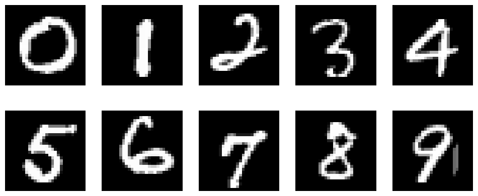
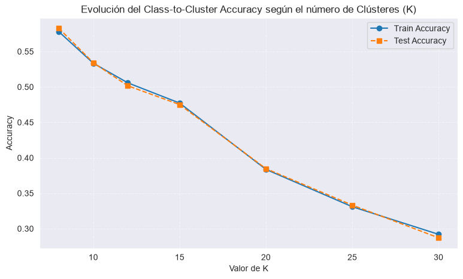
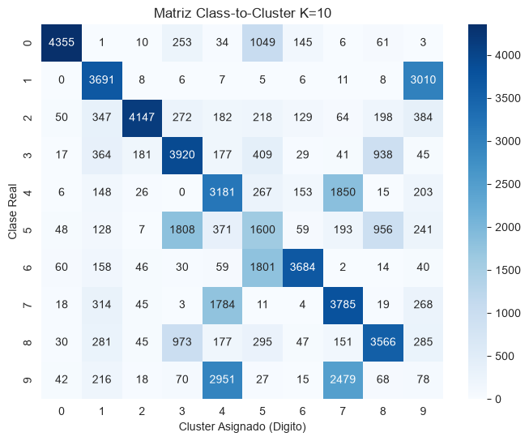
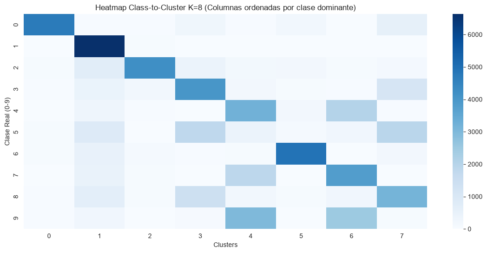
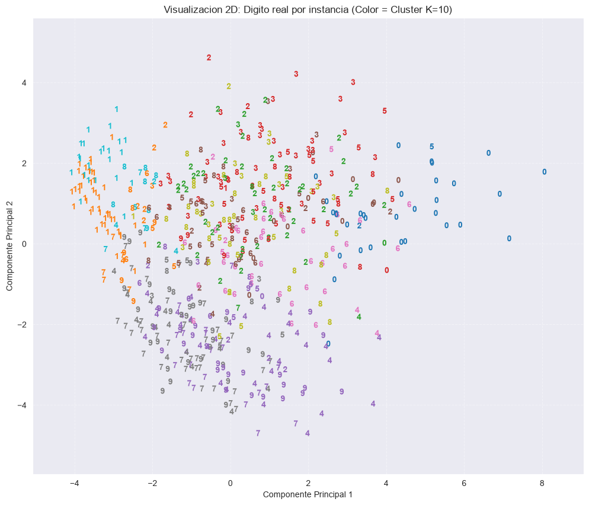

[🇬🇧 English](README.md) | [🇪🇸 Español](README.es.md)

# MNIST Unsupervised Clustering & Latent Space Analysis Pipeline

<p align="center">
  
  
  
  
  
  
</p>

---

## 📌 Resumen Ejecutivo

**MNIST Unsupervised Clustering & Latent Space Analysis** es un proyecto de investigación experimental y aprendizaje no supervisado sobre el dataset de dígitos manuscritos **MNIST (784 dimensiones)**. 

El pipeline aborda el reto de descubrir, estructurar y evaluar agrupamientos naturales en datos de alta dimensionalidad sin supervisión de etiquetas durante el entrenamiento. Combina técnicas de **Reducción de Dimensionalidad (PCA)**, **K-Means**, modelos probabilísticos de mezcla gaussiana (**GMM**) y optimización combinatoria sobre grafos bipartitos mediante el **Algoritmo Húngaro (Kuhn-Munkres)** para resolver la correspondencia óptima clúster-clase y evaluar la pureza latente.

---

## 🔬 Metodología Experimental y Resultados Visuales

### 1. Exploración y Preparación de Datos (EDA)
Descarga automatizada del dataset `mnist_784` desde OpenML, normalización al rango $[0, 1]$ para estabilidad numérica y partición estratificada con un conjunto de prueba independiente de 10.000 muestras para evitar fugas de datos.

<p align="center">
  
  <br>
  <em>Figura 1: Muestras representativas del espacio de píxeles tras normalización.</em>
</p>

---

### 2. Reducción de Dimensionalidad con PCA
Se evaluó el impacto de la compresión espectral sobre diferentes tamaños de dimensión latente: $d \in [10, 20, 40, 60, 100, 150, 784]$.
* **Hallazgo:** Proyectar a $d \in [40, 60]$ dimensiones retiene más del 85% de la varianza explicada, filtrando ruido de alta frecuencia en los bordes de los píxeles y acelerando la convergencia de K-Means en más de un 90% respecto al espacio original de 784 dimensiones.

---

### 3. Barrido de Clústeres ($K$) y Generalización Train-Test
Se ejecutaron barridos hiperparamétricos de $K \in [8, 30]$ analizando métricas de validación intrínsecas (Coeficiente de Silueta e Índice de Calinski-Harabasz) junto a la precisión de correspondencia (*Class-to-Cluster Accuracy*):

<p align="center">
  
  <br>
  <em>Figura 2: Consistencia entre curvas de entrenamiento y prueba a medida que incrementa K.</em>
</p>

---

### 4. Alineación mediante Algoritmo Húngaro y Análisis de Confusión
Dado que el clustering no supervisado asigna identificadores arbitrarios a cada partición, se implementa el **Algoritmo Húngaro** (`linear_sum_assignment`) sobre la matriz de contingencia cruzada para resolver la asignación biunívoca de coste mínimo:

<p align="center">
  
  &nbsp;&nbsp;
  
  <br>
  <em>Figura 3: Matriz de confusión para K=10 (izq.) y descomposición por clases dominantes para K óptimo (der.).</em>
</p>

---

### 5. Proyección del Espacio Latente en 2D
Visualización comparativa de las primeras dos componentes principales, contrastando las particiones descubiertas por K-Means contra las clases reales del dataset:

<p align="center">
  
  <br>
  <em>Figura 4: Separación de densidades en el plano latente PCA 2D (Clusters vs Clases Reales).</em>
</p>

---

## 💡 Hallazgos Clave e Interpretación de Datos

1. **El fenómeno del sub-clustering ($K > 10$):**
   Aunque existen 10 clases reales (dígitos del 0 al 9), incrementar $K$ hacia 20 o 30 eleva notablemente la precisión del alineamiento. Esto se debe a que K-Means asume clústeres esféricos e isótropos; los dígitos manuscritos presentan **distribuciones multimodales** según el estilo tipográfico (por ejemplo: el '7' europeo con barra horizontal frente al '7' americano continuo, o el '1' recto frente al '1' con serifa inclinada). Permitir múltiples sub-clústeres por dígito incrementa la pureza de cada partición.
2. **Fronteras de ambigüedad topológica:**
   El análisis de confusión muestra que los mayores solapamientos ocurren entre los pares **(4, 9)** y **(3, 5)**. En el espacio latente reducido, la morfología de trazo cerrado vs abierto genera solapamientos densos que justifican el uso de modelos probabilísticos como **GMM**.
3. **Inferencia Out-of-Sample sin Data Leakage:**
   El pipeline implementa una función de inferencia (`predict_new_instance`) que proyecta nuevas imágenes utilizando estrictamente los transformadores ajustados previamente en la fase de entrenamiento, garantizando portabilidad hacia entornos productivos.

---

## 🏗️ Estructura del Repositorio

```text
MNIST_Clustering/
├── assets/                    # Figuras y visualizaciones extraídas del pipeline
│   ├── accuracy_vs_k.png
│   ├── confusion_matrix_k10.png
│   ├── eda_digits_sample.png
│   ├── heatmap_best_k.png
│   └── pca_2d_clusters.png
├── src/                       # Módulos Python reutilizables
│   ├── __init__.py
│   └── inference.py           # Algoritmo Húngaro y predicción de nuevas instancias
├── notebook.ipynb             # Notebook interactivo de experimentación completa
├── requirements.txt           # Dependencias reproducibles del entorno
├── .gitignore                 # Reglas de exclusión de Git
└── LICENSE                    # Licencia MIT
```

---

## ⚙️ Instalación y Uso

### 1. Clonar el repositorio y preparar el entorno:
```bash
git clone https://github.com/aimarlarriba/MNIST_Clustering.git
cd MNIST_Clustering

# Crear entorno virtual
python -m venv venv

# Activar entorno virtual
# En Windows:
venv\Scripts\activate
# En Linux/macOS:
source venv/bin/activate

# Instalar dependencias
pip install -r requirements.txt
```

### 2. Ejecutar el Notebook de Experimentación:
```bash
jupyter notebook notebook.ipynb
```

---

## 👥 Contexto Académico

Desarrollado originalmente como trabajo experimental para la asignatura de **Minería de Datos** en la **Universidad del País Vasco (UPV/EHU)**. 

Consolidado, estructurado y documentado por **[Aimar Larriba](https://github.com/aimarlarriba)** como portfolio de aprendizaje no supervisado y análisis de espacios latentes.

---

## ⚖️ Licencia

Distribuido bajo la Licencia **MIT**. Consulta el archivo [LICENSE](LICENSE) para más detalles.
